# Order Creation & Shipping Workflow - Detailed Flowchart

## Complete Understanding Document

```mermaid
graph TD
    Start([User Opens Order Creation Form]) --> FillDetails[Fill Complete Order Details:<br/>- Customer Info<br/>- Delivery Address with Pincode<br/>- Pickup Address with Pincode<br/>- Products<br/>- Weight & Dimensions<br/>- Payment Mode COD/Prepaid]
    
    FillDetails --> CalculateShipping[Calculate Shipping Charges Section]
    
    CalculateShipping --> CallDelhiveryZone[Call Delhivery Shipment Cost Calculation API<br/>Endpoint: /api/kinko/v1/invoice/charges/.json<br/>Parameters: o_pin, d_pin, cgm weight, md, ss, pt]
    
    CallDelhiveryZone --> GetZone[Extract ONLY Zone from Delhivery Response<br/>Zone: A, B, C, D, E, or F<br/>IGNORE all other Delhivery pricing data]
    
    GetZone --> CalculateOurRates[Calculate Shipping Charges from OUR Rate Card<br/>Use rateCardService.js/ts<br/>Input: Zone from Delhivery + Weight + User Category<br/>Calculate based on weight slabs logic]
    
    CalculateOurRates --> DisplayCharges[Display Calculated Shipping Charges on Frontend<br/>Show: Forward Charges, COD Charges if applicable, Total]
    
    DisplayCharges --> TwoButtons{User Clicks Button}
    
    TwoButtons -->|Button 1: Save| SaveFlow[Save Button Flow]
    TwoButtons -->|Button 2: Save and Assign| SaveAssignFlow[Save and Assign Order Button Flow]
    
    %% SAVE BUTTON FLOW
    SaveFlow --> SaveToDB1[Save Order to MongoDB<br/>Status: 'new']
    SaveToDB1 --> DeductWallet1[Deduct Shipping Charges from Wallet<br/>Update wallet_balance in MongoDB]
    DeductWallet1 --> ShowInNewTab[Order Appears in NEW Tab<br/>Action Column Shows: Generate AWB Number Button]
    
    ShowInNewTab --> ClickGenerateAWB{User Clicks<br/>Generate AWB Number Button}
    ClickGenerateAWB --> GenerateAWB[Call Backend API: POST /api/orders/:id/generate-awb<br/>Uses existing Delhivery AWB generation method<br/>AWB generated and saved to order.delhivery_data.waybill]
    
    GenerateAWB --> ShowReadyToShip[Ready to Ship Button Appears<br/>in Action Column<br/>Generate AWB must be clicked first]
    
    ShowReadyToShip --> ClickReadyToShip{User Clicks<br/>Ready to Ship Button}
    ClickReadyToShip --> CreateShipment[Call CREATE SHIPMENT API<br/>POST to Delhivery API<br/>Create shipment on Delhivery server]
    
    CreateShipment --> MoveToReadyToShip[Order Moves to READY TO SHIP Tab<br/>Status: 'ready_to_ship']
    
    MoveToReadyToShip --> RequestPickup[Request Pickup Button Visible<br/>Add Frontend Date/Time Selection:<br/>- Pickup Date: Same Day / Next Day / Day After<br/>- Pickup Time: 10 AM-2 PM / 2 PM-6 PM]
    
    RequestPickup --> ClickPickup{User Clicks<br/>Request Pickup Button}
    ClickPickup --> SendPickupParams[Send pickup_date and pickup_time<br/>as request parameters to Delhivery API<br/>POST /api/orders/:id/request-pickup]
    
    SendPickupParams --> PickupScheduled[Pickup Scheduled on Delhivery<br/>Order Status: 'pickups_manifests']
    
    %% SAVE AND ASSIGN ORDER BUTTON FLOW
    SaveAssignFlow --> SaveToDB2[Save Order to MongoDB<br/>Status: 'new']
    SaveToDB2 --> GenerateAWB2[Generate AWB Number Immediately<br/>Call Backend API: POST /api/orders/:id/generate-awb<br/>Uses existing Delhivery AWB generation method]
    
    GenerateAWB2 --> DeductWallet2[Deduct Shipping Charges from Wallet<br/>Update wallet_balance in MongoDB<br/>Calculate charges using:<br/>1. Get Zone from Delhivery API<br/>2. Calculate from rateCardService based on zone+weight]
    
    DeductWallet2 --> ShowShippingRates[Display Shipping Rates on Frontend<br/>Show calculated charges from OUR rate card<br/>NOT Delhivery's charges]
    
    ShowShippingRates --> CreateShipment2[Call CREATE SHIPMENT API<br/>POST to Delhivery API<br/>Create shipment on Delhivery server]
    
    CreateShipment2 --> MoveToPickupsManifests[Order Directly Shows in<br/>PICKUPS AND MANIFESTS Tab<br/>Status: 'pickups_manifests'<br/>All steps completed in one click]
    
    PickupScheduled --> End([End])
    MoveToPickupsManifests --> End
    
    style Start fill:#e1f5ff
    style End fill:#d4edda
    style SaveFlow fill:#fff3cd
    style SaveAssignFlow fill:#cfe2ff
    style CalculateOurRates fill:#f8d7da
    style GetZone fill:#d1ecf1
```



## Detailed Step-by-Step Breakdown

### Phase 1: Order Details Entry & Shipping Calculation

```
1. User fills order form:
   ├─ Customer information
   ├─ Delivery address (with pincode)
   ├─ Pickup address (with pincode)
   ├─ Products list
   ├─ Package weight & dimensions
   └─ Payment mode (COD/Prepaid)

2. Shipping Charges Calculation Section:
   ├─ Call Delhivery API: /api/kinko/v1/invoice/charges/.json
   │  Parameters:
   │  ├─ o_pin: Pickup pincode
   │  ├─ d_pin: Delivery pincode
   │  ├─ cgm: Chargeable weight in grams
   │  ├─ md: Billing mode (E/S)
   │  ├─ ss: Shipment status (Delivered/RTO/DTO)
   │  └─ pt: Payment type (Pre-paid/COD)
   │
   ├─ Extract ONLY Zone from Response:
   │  └─ Zone: A, B, C, D, E, or F
   │  └─ IGNORE all Delhivery pricing data
   │
   └─ Calculate OUR Shipping Charges:
      ├─ Use rateCardService.calculateShippingCharges()
      ├─ Input: Zone (from Delhivery) + Weight + User Category
      ├─ Apply weight slab logic:
      │  ├─ 0-250gm: Base charge
      │  ├─ 250-500gm: Base + additive
      │  ├─ 500gm-5kg: Base + 250-500gm + (500gm increments × rate)
      │  ├─ 5kg: Cumulative checkpoint
      │  ├─ 5kg-10kg: Upto 5kg + (1kg increments × rate)
      │  ├─ 10kg: Cumulative checkpoint
      │  └─ >10kg: Upto 10kg + (1kg increments × rate)
      └─ Display: Forward Charges + COD Charges = Total
```

### Phase 2A: "Save" Button Flow

```
Step 1: Save Order
   ├─ POST /api/orders (with generate_awb=false)
   ├─ Save to MongoDB with status: 'new'
   └─ Deduct shipping charges from wallet

Step 2: Order in NEW Tab
   ├─ Order appears in "NEW" tab
   └─ Action Column shows: "Generate AWB Number" button

Step 3: Generate AWB Number (Manual)
   ├─ User clicks "Generate AWB Number" button
   ├─ POST /api/orders/:id/generate-awb
   ├─ Backend calls Delhivery AWB generation API
   ├─ AWB saved to order.delhivery_data.waybill
   └─ "Ready to Ship" button appears in Action Column

Step 4: Ready to Ship (Manual)
   ├─ User clicks "Ready to Ship" button
   ├─ POST to Delhivery CREATE SHIPMENT API
   ├─ Create shipment on Delhivery server
   └─ Order status: 'ready_to_ship'

Step 5: Move to READY TO SHIP Tab
   ├─ Order appears in "READY TO SHIP" tab
   └─ Action Column shows: "Request Pickup" button

Step 6: Request Pickup (Manual)
   ├─ Frontend shows date/time picker:
   │  ├─ Pickup Date options:
   │  │  ├─ Same Day (today)
   │  │  ├─ Next Day (tomorrow)
   │  │  └─ Day After (day after tomorrow)
   │  └─ Pickup Time options:
   │     ├─ 10 AM - 2 PM
   │     └─ 2 PM - 6 PM
   ├─ User clicks "Request Pickup" button
   ├─ POST /api/orders/:id/request-pickup
   │  Body: { pickup_date, pickup_time }
   ├─ Backend calls Delhivery Pickup Request API
   └─ Order status: 'pickups_manifests'
```

### Phase 2B: "Save and Assign Order" Button Flow

```
Step 1: Save Order
   ├─ POST /api/orders (with generate_awb=true)
   ├─ Save to MongoDB with status: 'new'

Step 2: Generate AWB Number (Automatic)
   ├─ Immediately call POST /api/orders/:id/generate-awb
   ├─ Backend calls Delhivery AWB generation API
   └─ AWB saved to order.delhivery_data.waybill

Step 3: Calculate & Deduct Shipping Charges
   ├─ Get Zone from Delhivery API (already done in Step 1)
   ├─ Calculate charges using rateCardService:
   │  └─ Zone + Weight + User Category → Our rates
   ├─ Display shipping rates on frontend
   └─ Deduct from wallet

Step 4: Create Shipment (Automatic)
   ├─ POST to Delhivery CREATE SHIPMENT API
   └─ Create shipment on Delhivery server

Step 5: Move to PICKUPS AND MANIFESTS Tab (Automatic)
   ├─ Order directly appears in "PICKUPS AND MANIFESTS" tab
   ├─ Status: 'pickups_manifests'
   └─ All steps completed in one click
```

## Key Implementation Points

### 1. Shipping Charges Calculation (Before Save)
- **Location**: Frontend OrderCreationModal component
- **API Call**: Delhivery `/api/kinko/v1/invoice/charges/.json`
- **Extract**: Only `zone` from response
- **Calculate**: Use `rateCardService.calculateShippingCharges(zone, weight, userCategory)`
- **Display**: Show calculated charges in UI before user clicks Save

### 2. "Save" Button Implementation
- **Backend Route**: `POST /api/orders` with `generate_awb=false`
- **Actions**:
  1. Save order to MongoDB (status: 'new')
  2. Deduct shipping charges from wallet
  3. Return order data
- **Frontend**: Show order in "NEW" tab with "Generate AWB Number" button

### 3. "Generate AWB Number" Button
- **Backend Route**: `POST /api/orders/:id/generate-awb` (already exists)
- **Action**: Call Delhivery AWB generation API
- **Result**: AWB saved, "Ready to Ship" button appears

### 4. "Ready to Ship" Button
- **Backend Route**: Need to create or use existing CREATE SHIPMENT endpoint
- **Action**: Call Delhivery CREATE SHIPMENT API
- **Result**: Order moves to "READY TO SHIP" tab

### 5. "Request Pickup" Button Enhancement
- **Current**: Already working, calls `/api/orders/:id/request-pickup`
- **Enhancement**: Add frontend date/time selection:
  - Date: Today / Tomorrow / Day After Tomorrow
  - Time: 10 AM-2 PM / 2 PM-6 PM
- **Backend**: Already accepts `pickup_date` and `pickup_time` parameters

### 6. "Save and Assign Order" Button Implementation
- **Backend Route**: `POST /api/orders` with `generate_awb=true` + automatic shipment creation
- **Actions** (in sequence):
  1. Save order to MongoDB
  2. Generate AWB Number
  3. Calculate & deduct shipping charges (using our rate card)
  4. Create shipment on Delhivery
  5. Update order status to 'pickups_manifests'
- **Frontend**: Show order directly in "PICKUPS AND MANIFESTS" tab

## API Endpoints Reference

### Existing Endpoints (Already Working)
- `POST /api/orders/:id/generate-awb` - Generate AWB number
- `POST /api/orders/:id/request-pickup` - Request pickup (accepts pickup_date, pickup_time)

### Endpoints to Check/Create
- `POST /api/orders` - Create order (needs `generate_awb` parameter support)
- `POST /api/orders/:id/create-shipment` - Create shipment on Delhivery (may need to create)

### Delhivery API Calls
- `GET /api/kinko/v1/invoice/charges/.json` - Get zone (for shipping calculation)
- `POST /api/p/createShipment` - Create shipment (for "Ready to Ship")
- `POST /fm/request/new/` - Request pickup (already integrated)

## Files to Modify

### Frontend
1. `frontend/src/components/OrderCreationModal.tsx`
   - Add shipping charges calculation section
   - Add "Save" and "Save and Assign Order" buttons
   - Add date/time picker for pickup request

2. `frontend/src/pages/Orders.tsx`
   - Update "Generate AWB Number" button logic
   - Add "Ready to Ship" button
   - Update "Request Pickup" modal with date/time selection

### Backend
1. `backend/routes/orders.js`
   - Enhance `POST /api/orders` to handle `generate_awb` parameter
   - Add automatic shipment creation option
   - Ensure wallet deduction happens correctly

2. `backend/services/delhiveryService.js`
   - Already has `getZoneFromDelhivery()` method
   - Already has `createShipment()` method
   - Verify CREATE SHIPMENT API integration

3. `backend/services/rateCardService.js`
   - Already has `calculateShippingCharges()` method
   - Verify zone mapping (C1/C2→C, D1/D2→D)

## Summary

✅ **I understand the complete workflow:**
1. Calculate shipping charges before save (using Delhivery zone + our rate card)
2. Two button flows: "Save" (manual steps) vs "Save and Assign Order" (automatic)
3. Manual flow: Save → Generate AWB → Ready to Ship → Request Pickup
4. Automatic flow: Save + Generate AWB + Create Shipment → Direct to Pickups & Manifests
5. Pickup request enhancement: Add date/time selection UI

All clear? Should I proceed with implementation?

