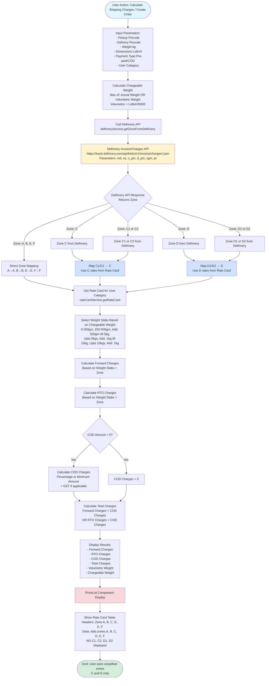

# Zone Simplification & Rate Calculation Flowchart

## Complete Flow Diagram



## Key Changes Implemented

### 1. Zone Determination Flow
```
OLD: Manual Calculation (getZoneFromPincode)
  ├─ Check pincode first digits
  ├─ Calculate zone based on distance/rules
  └─ Return C1, C2, D1, D2

NEW: Delhivery API (getZoneFromDelhivery)
  ├─ Call Delhivery invoice/charges API
  ├─ Get zone from Delhivery response
  └─ Return zone directly from API
```

### 2. Zone Mapping Logic
```
Delhivery Returns → Internal Zone Used
─────────────────────────────────────
A              → A (direct)
B              → B (direct)
C              → C (direct - NEW!)
C1             → C (mapped from C1)
C2             → C (mapped from C2)
D              → D (direct - NEW!)
D1             → D (mapped from D1) 
D2             → D (mapped from D2)
E              → E (direct)
F              → F (direct)
```

### 3. Rate Card Structure
```
OLD Rate Card Zones:
  zones: { A, B, C1, C2, D1, D2, E, F }

NEW Rate Card Zones:
  zones: { A, B, C, D, E, F }
  - C rates = Previous C2 rates
  - D rates = Previous D2 rates
  - C1 and D1 removed completely
```

### 4. PriceList Display
```
OLD Table Headers:
  Zone A | Zone B | Zone C1 | Zone C2 | Zone D1 | Zone D2 | Zone E | Zone F

NEW Table Headers:
  Zone A | Zone B | Zone C | Zone D | Zone E | Zone F

Data Access:
  OLD: slab.zones.C1, slab.zones.C2, slab.zones.D1, slab.zones.D2
  NEW: slab.zones.C, slab.zones.D
```

## Files Modified

### Backend
1. **`backend/services/delhiveryService.js`**
   - Added `getZoneFromDelhivery()` method
   - Updated `getRates()` to return zone

2. **`backend/routes/orders.js`**
   - Removed `getZoneFromPincode()` function
   - Uses `delhiveryService.getZoneFromDelhivery()` for zone

3. **`backend/routes/tools.js`**
   - Removed zone calculation functions
   - Uses `delhiveryService.getZoneFromDelhivery()` for zone

4. **`backend/services/rateCardService.js`**
   - Updated `getZoneKey()` to map C1/C2→C, D1/D2→D
   - Rate cards already use C and D zones

5. **`backend/routes/shipping.js`**
   - Updated validation to accept only ['A', 'B', 'C', 'D', 'E', 'F']

### Frontend
1. **`frontend/src/services/shippingService.ts`**
   - Updated TypeScript interface to use C, D instead of C1/C2/D1/D2

2. **`frontend/src/services/rateCardService.ts`**
   - Updated `getZoneKey()` to map zones
   - Rate cards already use C and D zones

3. **`frontend/src/components/PriceList.tsx`**
   - Updated headers to show Zone C and Zone D
   - Updated data access to use `slab.zones.C` and `slab.zones.D`

4. **`frontend/src/components/ShippingCalculator.tsx`**
   - Updated zone dropdown to show only Zone C and Zone D

5. **`frontend/src/components/OrderCreationModal.tsx`**
   - Deprecated `determineZone()` function

## Benefits

✅ **Simplified Zone Structure**: Only 6 zones (A, B, C, D, E, F) instead of 8
✅ **Delhivery Authority**: Zone determination comes from Delhivery API
✅ **Consistent Mapping**: C1/C2 both map to C, D1/D2 both map to D
✅ **Clean UI**: PriceList shows simplified zones
✅ **Backward Compatible**: Old C2/D2 data still works via mapping

